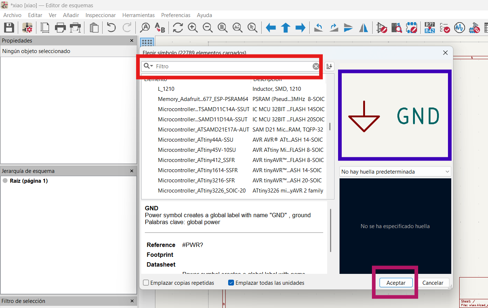
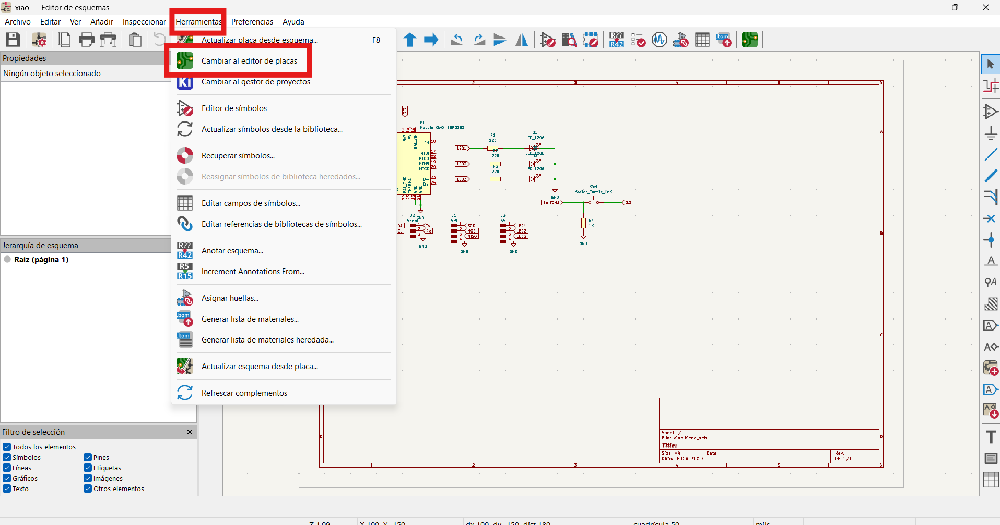
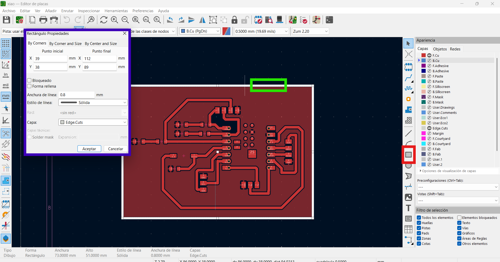
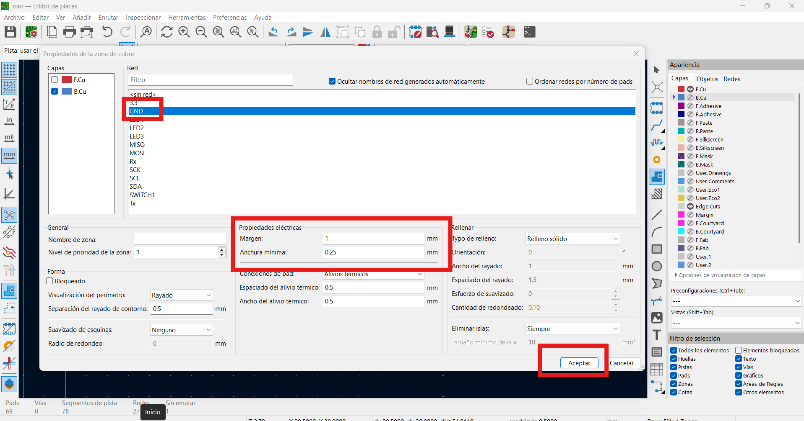
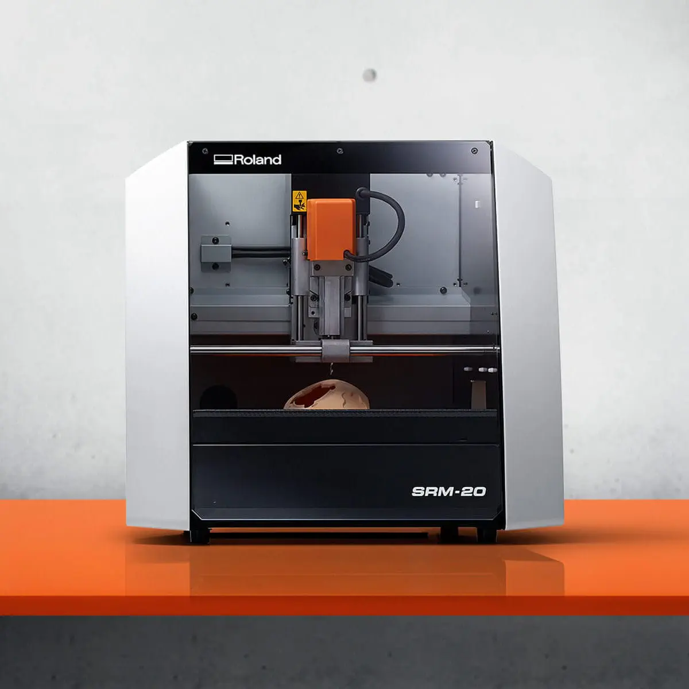
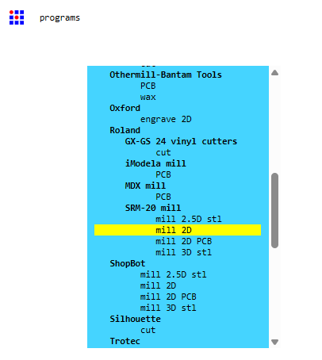
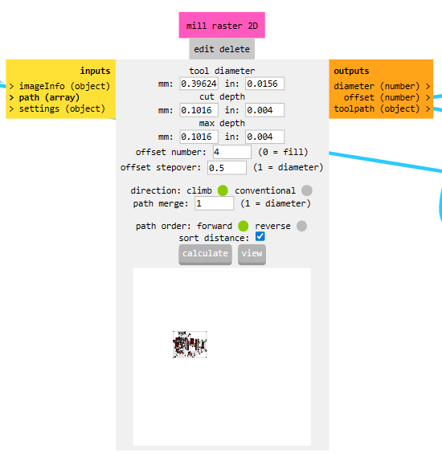

# Práctica 2: Diseño y elaboración de PCB

En esta sección realizamos el diseño de una PCB en KiCAD y preparamos los archivos de fabricación en FabLab. Posteriormente, generamos el archivo de grabado (toolpaths) para poder maquinar la placa en una MonoFab SRM-20 Desktop Milling Machine, asegurando las dimensiones, el ruteo y la configuración correcta antes del fresado.

## 1) Instalación y configuración del complemento FabLab en KiCAD

Primero, se debe descargar e instalar **KiCAD**. Al abrir el programa, se mostrará una ventana inicial (ver **Figura 1**). En esta etapa, el siguiente paso es configurar el complemento necesario para trabajar con FabLab:

1. Haz clic en Gestor de complementos.  
2. En la ventana que aparece, selecciona la pestaña Instalados (en la parte superior).  
3. Busca e instala el complemento KiCAD FabLab.  
4. Finalmente, presiona el botón Actualizar para aplicar los cambios y, al terminar, cierra la ventana del gestor.

*Figura 1:* Pantalla inicial de configuración en el software KiCAD.

## 2) Creación de un nuevo proyecto y acceso al editor esquemático en KiCAD

El siguiente paso es crear un nuevo proyecto. Desde la misma ventana inicial (ver Figura 1), ve al menú Archivo y selecciona Nuevo proyecto. Después, guarda el proyecto en la ruta que prefieras.

Una vez creado, el proyecto aparecerá en la barra lateral izquierda. Para comenzar con el diseño, haz clic en Esquemático, como se muestra en la Figura 2 (recuadro rojo).

*Figura 2:* Creación de un nuevo proyecto.

## 3) Búsqueda e inserción de componentes en el editor esquemático

Como tercer paso, se mostrará una ventana similar a la de la Figura 3 (nota: al abrirla no se visualizarán los componentes como en la imagen de ejemplo). Para buscar e insertar diferentes componentes, utiliza la barra de herramientas del lado izquierdo. En la Figura 3 (flecha y recuadro rojo), debes dar clic en el icono “Place symbols (A)”.

*Figura 3:* Barra de herramientas del editor esquemático y acceso a “Place symbols (A)”.

Al seleccionarlo, se abrirá una ventana como la que se muestra en la Figura 4. Ahí podrás buscar el componente que necesitas. Al elegirlo, en el lado derecho (recuadro azul) se mostrará la vista previa del símbolo para verificar que sea el correcto. Cuando lo tengas identificado, presiona el botón “Aceptar” en la parte inferior.

*Figura 4:* Ventana de selección de componentes: búsqueda y vista previa del símbolo.

**Nota**: para este paso es importante que ya tengas definidos previamente los componentes que vas a utilizar.

## 4) Colocación de componentes, uso de etiquetas y conexión del circuito

Luego de seleccionar el componente, podrás colocarlo en el esquemático como se muestra en la Figura 5 (recuadro rojo). Al hacer clic para posicionarlo, puedes repetir la colocación tantas veces como necesites. Para dejar de insertar componentes y volver al cursor normal, presiona la tecla Esc.

Para mantener el diagrama más limpio y evitar demasiados cables cruzados, se recomienda usar etiquetas. Para ello, da clic en la herramienta **Label** indicada en la Figura 5 (flecha y recuadro azul) y coloca el nombre de la señal donde corresponda.

Finalmente, para unir los componentes con cables, selecciona la herramienta de conexión (wire) y haz clic derecho en el punto de inicio (en la esquina o pin del componente). Después, mueve el cursor hasta el punto donde deseas conectar y vuelve a hacer clic derecho para realizar la unión.

*Figura 5:* Colocación de componentes y herramienta de etiquetas (Label)

## 5) Cambio al editor de placas y actualización de componentes en la PCB

Ahora, para comenzar con el ruteo de pistas, es necesario cambiar al editor de placas. Para hacerlo, ve a Herramientas y selecciona Cambiar a editor de placas, como se muestra en la Figura 6. Esto te redirigirá al editor de PCB.

*Figura 6:* Opción “Cambiar a editor de placas” desde el menú Herramientas

Es normal que, al entrar, no aparezcan los componentes de inmediato. En ese caso, debes ir nuevamente a Herramientas y seleccionar Actualizar placa desde esquema, como se muestra en la Figura 7. En la ventana que se despliega, da clic en Actualizar placa. Con esto se cargarán y visualizarán los componentes que colocaste previamente en el esquemático.

*Figura 7:* Actualización de la PCB para visualizar los componentes importados desde el esquemático

## 6) Enrutado de pistas y definición del ancho en el editor de PCB

Al completar el paso anterior, la placa se mostrará como en la Figura 8: con los componentes ya visibles, pero aún sin las pistas. (Nota: la imagen de referencia puede mostrar el resultado final, en esta etapa todavía no se han trazado las conexiones).

Una vez que acomodes los componentes de la manera que mejor convenga, puedes comenzar a dibujar las pistas utilizando la herramienta de enrutado (Route tracks), que se ve en el recuadro rojo de la Figura 8. Se recomienda trabajar con un ancho de pista de 0.8 mm a 1.0 mm para facilitar el fresado y asegurar una buena conectividad.

Para definir el tamaño de la pista, selecciona el menú de del recuadro azul en la Figura 8 y elige "Editar valores predefinidos".

*Figura 8:* Editor de PCB: ubicación de la herramienta de enrutado y selección del ancho de pista

Se desplegará una ventana como la que se muestra en la Figura 9. Ahí podrás agregar los valores de ancho de pista que desees utilizar. Para añadir un nuevo valor, da clic en el símbolo “+” en la parte inferior y escribe el ancho correspondiente (por ejemplo, 0.8 mm o 1.0 mm).

Una vez que agregues los valores necesarios, presiona Aceptar. Con esto, ya podrás comenzar a enrutar las pistas, selecciona el punto de inicio y arrastra el mouse hasta el punto final, de forma similar al proceso de conexión descrito en el Paso 4.

*Figura 9:* Ventana para agregar y seleccionar anchos de pista en KiCAD

## 7) Contorno de la PCB y plano de tierras (GND)
En este paso, como se muestra en la Figura 10, se define el contorno (borde) de la placa. Para ello, se dibuja un rectángulo alrededor del diseño utilizando la herramienta indicada en el recuadro rojo. Después, da doble clic sobre el borde (marcado en verde) para editar sus propiedades.

Finalmente, se abrirá una ventana como la señalada en el recuadro azul, donde podrás definir el ancho del trazo. Se recomienda utilizar un ancho de 0.8 mm y, en la opción de capa, seleccionar Edge.Cuts para que el contorno quede correctamente configurado para el corte.

*Figura 10:* Creación del contorno de la PCB: herramienta de rectángulo, edición del borde y selección de la capa Edge.Cuts

Como siguiente paso, en la Figura 11 se muestra (recuadro rojo) la herramienta Draw Filled Zones, la cual se utiliza para crear el plano de tierras (GND). Para comenzar, da clic en el ícono indicado y se desplegará una ventana de configuración donde podrás definir los parámetros de la zona.

*Figura 11:* Herramienta “Draw Filled Zones” para generar el plano de tierras (GND) en la PCB

En la ventana que se despliega (Figura 12), selecciona GND. Después, en la sección de margen, se recomienda trabajar con un valor de 0.5 a 1.0 mm. Una vez configurados estos parámetros, da clic en Aceptar.

Luego, delimita la zona seleccionando cada una de las esquinas del contorno definido para la placa. Al finalizar el trazo, presiona la tecla B para rellenar la zona y generar el plano de tierras.

*Figura 12:* Configuración del plano de tierras: selección de la red GND y ajuste del margen (clearance) antes de rellenar la zona.

Por último, ve al menú Archivo y selecciona Trazar (Plot). Primero genera el archivo de la capa Edge.Cuts, que corresponde al contorno (marco) de la placa, y después traza la capa F.Cu, que contiene las pistas del circuito. Una vez que tengas estos archivos generados, podrás continuar con el siguiente paso.

---

## 8) Fabricación de la PCB mediante fresado CNC (Roland SRM-20)

### 8.1 Herramienta y máquina utilizada

Para la fabricación de la tarjeta de circuito impreso se utilizó una **fresadora CNC de 3 ejes monoFab Roland SRM-20**, la cual permite realizar trabajos de alta precisión sobre placas de cobre para prototipado electrónico.

*Figura 13: Fresadora CNC Roland SRM-20 utilizada para el mecanizado del PCB.*

Como herramientas de corte se emplearon dos brocas:

* Una broca de **1 mm** para el grabado de pistas (devastado de cobre)
* Una broca adicional para el **corte perimetral de la placa**

Desde **KiCad** se exportaron dos archivos en formato **SVG**:

* Un archivo correspondiente al **grabado de pistas**
* Un archivo correspondiente al **corte o marco de la placa**

---

### 8.2 Acceso al entorno MODS

Para generar las trayectorias de mecanizado se ingresó a la plataforma web:

[https://hubergiron.github.io/cnc/mods/](https://hubergiron.github.io/cnc/mods/)

Una vez dentro del entorno, se realizó un **clic izquierdo sobre el área de trabajo** para desplegar el menú principal.

---

### 8.3 Selección del programa de fresado

Posteriormente se siguió la ruta:

**programs → open program**

donde se desplegó la lista de procesos disponibles. Dentro de esta se seleccionó:

**SRM-20 mill → mill 2D PCB**

correspondiente al flujo de trabajo específico para la fresadora Roland SRM-20 y fabricación de PCBs.

*Figura 14: Programa seleccionado para mecanizado de PCB.*

---

### 8.4 Carga de los archivos SVG

Una vez cargado el programa, se localizó el módulo **read SVG**, donde se utilizó el botón **select SVG file** para importar:

Primero el archivo del **grabado de pistas** y posteriormente el archivo correspondiente al **corte perimetral de la placa**.

*Figura 15: Importación del diseño del PCB en formato SVG.*

---

### 8.5 Configuración del mecanizado (mill raster 2D)

Después de cargar el SVG del grabado, se configuraron los parámetros del módulo **mill raster 2D**, ajustándolos al diseño de pistas (0.8 mm), plano de tierra (1 mm) y herramienta utilizada.

*Figura 16: Configuración de herramienta y profundidades de corte.*

Parámetros utilizados:

* Diámetro de herramienta: 1 mm
* Profundidad por pasada: 0.1 mm
* Profundidad máxima: 0.2 mm
* Número de offsets: 4
* Stepover: 0.5
* Dirección de corte: climb milling

---

### 8.6 Definición del origen y desplazamientos de la máquina

Posteriormente se configuró el módulo de control de la Roland SRM-20, donde se estableció el **origen de trabajo (X, Y, Z)**, que corresponde al punto físico desde el cual iniciará el fresado sobre la placa de cobre.

*Figura 17: Configuración de origen, altura de seguridad y posición home.*

Estos parámetros permiten:

* Alinear correctamente el diseño con el material
* Definir una altura segura de desplazamiento
* Regresar la máquina a una posición de reposo

---

### 8.7 Cálculo de trayectorias y generación del archivo CNC

Una vez configurados los parámetros, se regresó al módulo **mill raster 2D** y se presionó el botón **calculate**, con lo cual MODS generó automáticamente las trayectorias de mecanizado.

El sistema arrojó un archivo con extensión **.rml**, correspondiente al control de movimiento de la fresadora CNC.

*Figura 18: Cálculo automático de rutas de corte.*

Este mismo procedimiento se repitió utilizando el SVG del **corte perimetral**, generando un segundo archivo **.rml** para el marco de la placa.

---

### 8.8 Envío del archivo a la fresadora CNC mediante VPanel for SRM-20

Una vez generados los archivos **.rml** en MODS, estos se cargaron en el software **VPanel for SRM-20**, el cual permite controlar directamente la fresadora CNC y ejecutar las trayectorias de mecanizado.

*Figura 19: Software VPanel utilizado para el control de la fresadora Roland SRM-20.*

Dentro de este entorno se realizó primero la **definición del origen en el eje Z**, ajustando la altura de la herramienta hasta tocar suavemente la superficie de la placa de cobre. Este paso es fundamental para asegurar que la profundidad de corte sea correcta y evitar dañar el material o la herramienta.

Posteriormente se configuró el **origen en los ejes X y Y**, posicionando la broca en una esquina o punto de referencia de la placa, de acuerdo con la ubicación física del material sobre la cama de la máquina.

Es importante mencionar que estos orígenes se establecen **dependiendo de la herramienta utilizada** y deben reajustarse cada vez que se realiza un cambio de broca.

Una vez definidos los orígenes, se presionó el botón **Cut**, lo cual abrió una ventana para seleccionar el archivo con extensión **.rml** previamente generado en MODS. Después de cargar el archivo correspondiente al grabado o al corte, se presionó la opción **Output**, iniciando así el proceso automático de fresado del circuito.

Este mismo procedimiento se repitió tanto para el archivo del **grabado de pistas** como para el archivo del **corte perimetral de la placa**.

### 8.9 Resultado final de la PCB y prueba de funcionamiento

En la Figura 22 se muestra el resultado final de la placa PCB fabricada y ensamblada, donde se observa el microcontrolador XIAO montado junto con los componentes electrónicos correspondientes, así como las pistas correctamente ruteadas y soldadas. La calidad del fresado permitió definir de forma clara las conexiones del circuito, asegurando un correcto aislamiento entre pistas.

*Figura 22: PCB final ensamblada*

Una vez verificado el funcionamiento eléctrico de la placa, se cargó un programa de prueba para validar su operación. El sistema implementado utiliza un botón como entrada de control, permitiendo encender de manera secuencial tres LEDs. Al presionar el botón por primera vez se activa el primer LED, al presionarlo nuevamente se enciende el segundo, y en una tercera pulsación se activa el tercer LED.

Este comportamiento confirma la correcta lectura de entradas digitales, el control de salidas y la integración adecuada entre hardware y software en la placa desarrollada.

### 9 Video de funcionamiento del sistema

En el siguiente video se muestra el comportamiento del circuito durante la ejecución del programa, evidenciando el encendido secuencial de los LEDs al presionar el botón.

<video controls width="720">
  <source src="{{ '/assets/videos/funcionamiento_pcb.mp4' | relative_url }}" type="video/mp4">
  Tu navegador no soporta video HTML5.
</video>
