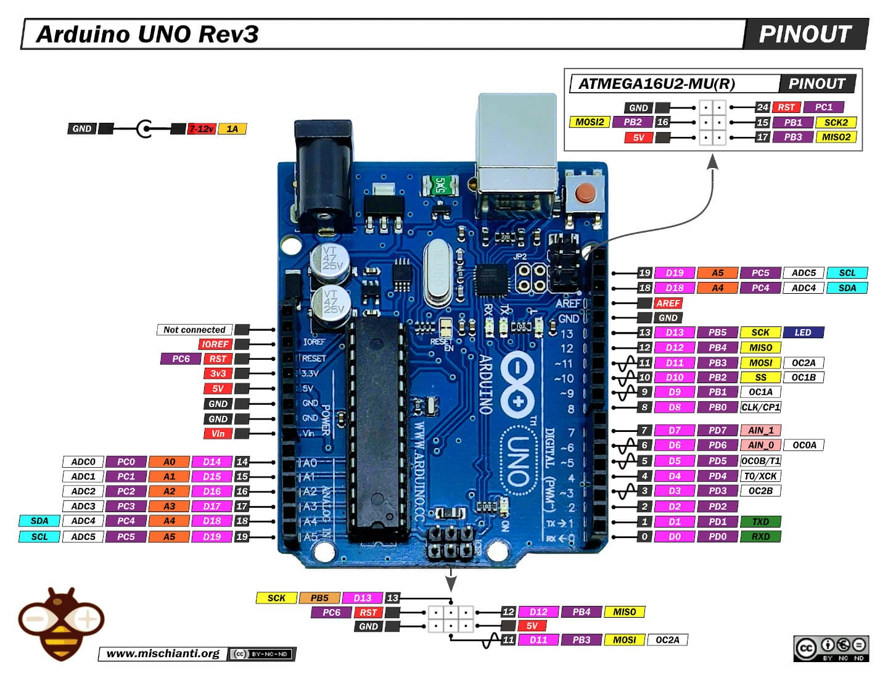
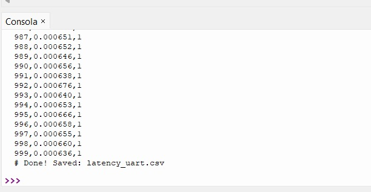

# Práctica 3: Protocolos de comunicación

En esta sección se realizó la implementación y evaluación de los protocolos de comunicación UART, I2C y SPI utilizando tres plataformas de sistemas embebidos: ATMEGA328, ESP32-S3 y RP2040. Para cada plataforma se configuraron los periféricos de comunicación correspondientes y se estableció la conexión entre dos dispositivos con el fin de transmitir datos de forma controlada. Posteriormente, se enviaron 1000 mensajes por cada protocolo para medir la latencia de comunicación, registrando los tiempos de transmisión y generando gráficas de comportamiento. Finalmente, se compararon los resultados obtenidos entre protocolos y plataformas, analizando el desempeño en términos de velocidad, estabilidad y tiempo de respuesta, e integrando en el reporte los diagramas de arquitectura, esquemas eléctricos y códigos utilizados.

## 1) Serial (UART)

UART (universal asynchronous receiver / transmitter, por sus siglas en inglés) se define como un protocolo para el intercambio de datos en serie entre dos dispositivos. UART utiliza solo dos hilos entre el transmisor y el receptor para transmitir y recibir en ambas direcciones. Ambos extremos tienen una conexión a masa. La comunicación en UART puede ser simplex(los datos se envían en una sola dirección), semidúplex(cada extremo se comunica, pero solo uno al mismo tiempo), o dúplex completo(ambos extremos pueden transmitir simultáneamente).

### 1.1 Imagen del microontrolador utilizados

En este apartado se muestra una fotografía de los pines de la *XIAO ESP32-S3 y Arduino UNO*, con el propósito de identificar de manera clara las conexiones utilizadas para el protocolo de comunicación empleado en la práctica.


*Figura 1:* Pinout XIAO ESP32-S3.


*Figura 2:* Pinout Arduino UNO.

### 1.2 Imagen de conexíon entre microontroladores 

En este apartado se muestra una fotografía de la conexión para el protocolo UART entre una XIAO ESP32-S3 como maestro y como esclavo Arduino UNO.


*Figura 3:* Conexión física.

### 1.3 Código utilizado

En el maestro se construye una trama de 6 bytes: byte de inicio, secuencia y checksum XOR; se envía por UART y se mide el tiempo hasta recibir el eco completo.

````md
```Micro python
START_BYTE = 0xA5

def make_frame(k: int) -> bytes:
    seq = struct.pack("<I", k)
    first5 = bytes([START_BYTE]) + seq
    cs = 0
    for bb in first5:
        cs ^= bb
    return first5 + bytes([cs])
```
````

En el esclavo se recibe la trama, se verifica el checksum y, si es válida, se responde con los mismos 6 bytes.


````md
```C++
const uint8_t START_BYTE = 0xA5;

uint8_t checksum5(const uint8_t *p) {
  uint8_t c = 0;
  for (int i = 0; i < 5; i++) c ^= p[i];
  return c;
}
```
````
### 1.4 Registro de datos en terminal

En la Figura 4 se presenta la salida de la terminal durante la ejecución del sistema de medición, en la cual se muestran de manera secuencial el índice del mensaje, la latencia de transmisión y un valor binario que indica la correcta recepción por parte del microcontrolador esclavo. La información fue guardada automáticamente en un archivo CSV para su análisis estadístico.


*Figura 4:* Datos registrados en terminal.


### 1.5 Resultados de latencia UART

En la Figura 5 se muestra la gráfica de latencia obtenida durante el envío de 1000 mensajes utilizando el protocolo UART. Cada punto representa el tiempo de transmisión de un mensaje individual, mientras que las líneas punteadas indican el valor promedio y una desviación estándar positiva y negativa. Se observa un comportamiento alrededor de 0.65 ms.


*Figura 5:* Gráfica de latencia UART.

## 2) Interfaz periférica en serie (SPI) 
Serial Peripheral Interface (SPI) es un protocolo de comunicación serie síncrono utilizado para permitir el intercambio de datos a alta velocidad entre un dispositivo maestro y varios dispositivos periféricos. Se trata de un sistema de comunicación full-duplex diseñado para transferir datos de forma rápida y eficaz en distancias cortas.

### 2.1 Imagen de conexíon entre microontroladores 

En este apartado se muestra una fotografía de la conexión para el protocolo SPI entre una XIAO ESP32-S3 como maestro y como esclavo Arduino UNO.


*Figura 6:* Conexión física.

### 2.2 Implementación del protocolo SPI

Para la medición de latencia se configuró el XIAO ESP32-S3 como dispositivo maestro SPI, encargado de enviar tramas de datos y medir el tiempo de cada transferencia. El Arduino UNO operó como dispositivo esclavo utilizando interrupciones para recibir los datos y devolver un eco de la información recibida, validando así la comunicación.

En el maestro se realizó la transferencia SPI completa y se midió el tiempo transcurrido en microsegundos:


````md
```Micro python
rx = xfer8(tx)
dt_sec = time.ticks_diff(t1, t0) / 1_000_000.0
```
````

Este fragmento permite calcular la latencia de cada transacción SPI desde el envío hasta la recepción del eco.

Por otro lado, en el esclavo se utilizó una máquina de estados basada en interrupciones para capturar los primeros bytes de la trama:

````md
```C++
if (byte_count < 4) {
    rx_seq[byte_count] = inByte;
}
```
````

Posteriormente, los datos recibidos se enviaron de vuelta al maestro durante los siguientes ciclos de reloj SPI, funcionando como confirmación de recepción.

La información generada fue almacenada en un archivo CSV y empleada para la generación de las gráficas de desempeño del protocolo SPI.

### 2.3 Resultados de latencia SPI

En la Figura 7 se presenta la gráfica de latencia obtenida mediante el protocolo SPI durante el envío de 1000 transacciones entre el XIAO ESP32-S3 (maestro) y el Arduino UNO (esclavo). Cada punto representa el tiempo requerido para completar una transferencia completa de datos, mientras que las líneas punteadas indican el valor promedio y una desviación estándar. Se observa una latencia promedio aproximada de 8.14 ms con variaciones mínimas, lo que evidencia un comportamiento estable y determinístico característico de los protocolos síncronos como SPI.


*Figura 7:* Gráfica de latencia SPI.

## 3) I2C (Inter-Integrated Circuit)
I2C es un protocolo de comunicación serie síncrona que utiliza dos líneas: SCL (reloj) y SDA (datos).
Permite una topología multipunto, conectando varios dispositivos en el mismo bus mediante un esquema maestro–esclavo.
Cada dispositivo se identifica con una dirección única, típicamente de 7 bits (hasta 128) o de 10 bits (más de 1000). Sus velocidades comunes incluyen 100 kbps, 400 kbps, 1 Mbps y hasta 3.4 Mbps.
La conexión es simple: solo SDA, SCL y GND compartidos.

### 3.1 Imagen de conexíon entre microontroladores 
En este apartado se muestra una fotografía de la conexión para el protocolo I2C entre una XIAO ESP32-S3 como maestro y como esclavo Arduino UNO.


*Figura 8:* Conexión física Maestro: XIAO ESP32-S3 / Esclavo: Arduino Uno.

### 3.2 Implementación del protocolo I2C

#### 3.2.1) Maestro (XIAO ESP32-S3, MicroPython)
- Frecuencia del reloj (SCL) y configuración del bus
- freq=FREQ_HZ define la frecuencia del reloj SCL que genera el maestro. Esa frecuencia controla cuán rápido se transmiten los bits en el bus

````md
```Micro python
    FREQ_HZ = 100000
    i2c = I2C(0, sda=Pin(5), scl=Pin(6), freq=FREQ_HZ)
```
````

- En el siguiente fragmento de código se mide:
    - a) Write: el ESP32 envía 4 bytes al UNO.
    - b) El UNO recibe y guarda `last_seq` (callback `onReceive`).
    - c) Read: el ESP32 hace una lectura de 4 bytes.
    - d) El UNO responde con `last_seq` (callback `onRequest`).

````md
```Micro python
    t0 = time.ticks_us()
    i2c.writeto(I2C_ADDR, payload)
    data = i2c.readfrom(I2C_ADDR, 4)
    t1 = time.ticks_us()
    dt_sec = time.ticks_diff(t1, t0)/1_000_000.0
```
````

- Verificación del mensaje: Si ok da 0 en algunos puntos, quiere decir que el dato no se envió ni recibió correctamente; si ok = 1, eso quiere decir que el dato se envió y recibió correctamente.

````md
```Micro python
    payload = struct.pack("<I", k)
    ack = struct.unpack("<I", data)[0]
    ok = 1 if ack == k else 0
```
````

#### 3.2.2) Esclavo (Arduino UNO)

El Arduino UNO funciona como esclavo I2C con la dirección 0x08 usando la librería Wire. Cuando el maestro (ESP32) le envía 4 bytes, el UNO los recibe en el callback `onReceiveHandler()`, reconstruye el número `uint32_t` en formato little-endian y lo guarda en `last_seq`. Después, cuando el maestro solicita datos, el callback `onRequestHandler()` responde enviando de regreso esos mismos 4 bytes. En este modo, el UNO no define la frecuencia del bus, sigue el reloj SCL que genera el maestro.

````md
```C++
    // Dirección del esclavo (0x08)
    #define I2C_ADDRESS 0x08
    Wire.begin(I2C_ADDRESS);

    // Registro de callbacks (recibir y responder)
    Wire.onReceive(onReceiveHandler);
    Wire.onRequest(onRequestHandler);

    // Recepción de 4 bytes y guardado en last_seq (little-endian)
    if (numBytes >= 4)
        {
        uint8_t b0 = Wire.read();
        uint8_t b1 = Wire.read();
        uint8_t b2 = Wire.read();
        uint8_t b3 = Wire.read();

        last_seq = ((uint32_t)b0) |
                    ((uint32_t)b1 << 8) |
                    ((uint32_t)b2 << 16) |
                    ((uint32_t)b3 << 24);
        }
```
````

### 3.3 Resultados de latencia I2C
En la gráfica de la Figura 9 se observa que la latencia por mensaje se mantiene muy estable a lo largo de los 1000 envíos. El promedio observado es de 1.6388 ms, y la variación es baja: la banda de ±1 desviación estándar va aproximadamente de 1.6261 ms a 1.6515 ms (≈ ±0.0127 ms, es decir, ±12.7 µs).

Un punto importante a considerar es cómo se mide el tiempo, en el ESP32 se usa `time.ticks_us()`, que cuenta microsegundos. Después ese valor se convierte a segundos. Esto significa que la medición tiene una precisión de aproximadamente 1 microsegundo y que el tiempo registrado incluye toda la operación I2C (enviar y recibir datos), además del tiempo que tarda el programa en ejecutar esas instrucciones. En resumen, con la frecuencia configurada del bus, el sistema logra una latencia promedio de ~1.64 ms por mensaje, con comportamiento consistente.


*Figura 9:* Gráfica de latencia I2C.

## 4) Conclusión
Para finalizar, con los resultados obtenidos promedio, el protocolo más rápido fue UART, ya que se observa un comportamiento alrededor de 0.65 ms por mensaje, siendo el menor tiempo de los tres. En segundo lugar queda I2C, con un promedio de 1.6388 ms, estable y con baja variación. Finalmente, SPI fue el más lento en tu implementación, con una latencia promedio de 8.14 ms. En conclusión, para este experimento y configuración, UART fue el mejor en velocidad, seguido de I2C, y SPI quedó como la opción menos rápida.
