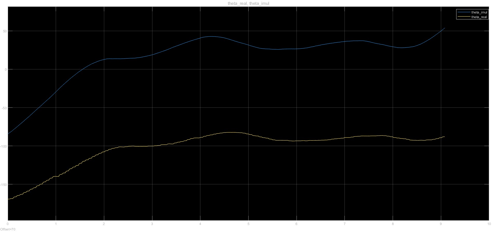
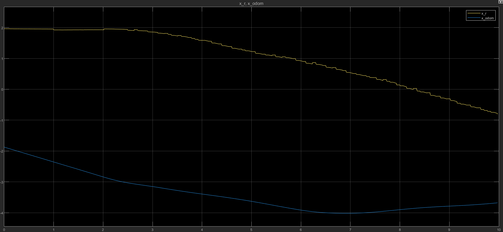
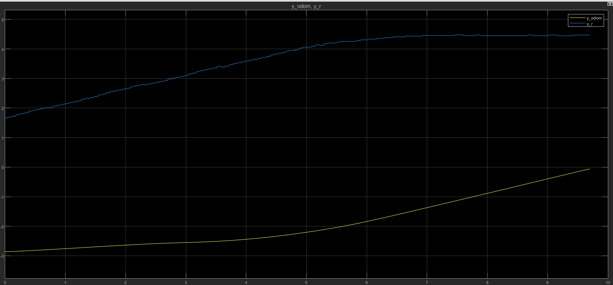
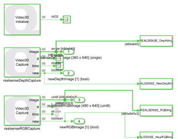
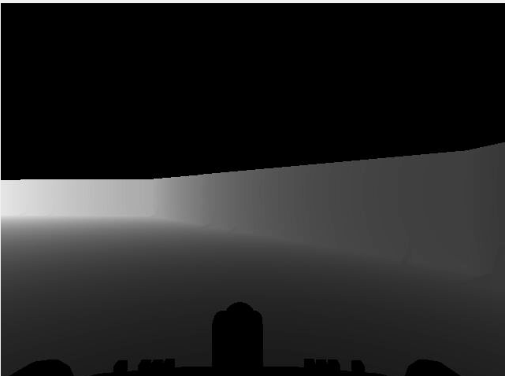
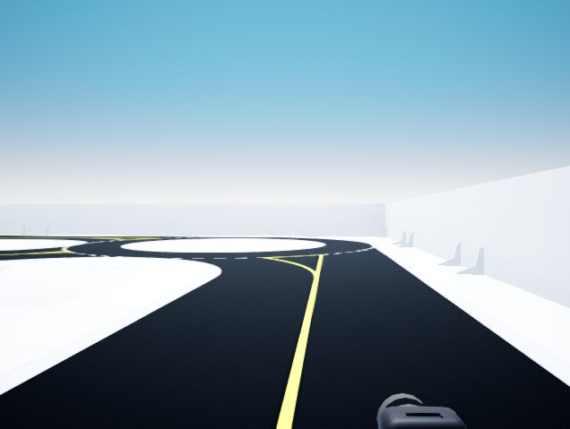

# CPS IoT Self-Driving Competition — Team Autonomous Wolf

## Context

This repository documents the development of our autonomous driving algorithm for the CPS IoT Self-Driving Car Competition, using the Quanser QCar 2 platform in the virtual QLabs environment.

We are currently in the **virtual stage**, where the main objective is to validate our perception system and state estimation before moving to the full implementation of the autonomous navigation algorithm.

---

## Objectives 

In this initial phase, we focus on:

- Validating QCar sensor readings:
  - Lidar  
  - IMU  
  - Wheel encoder  
  - RGBD camera  
  
- Implementing a bicycle kinematic model  
- Comparing different yaw (heading) estimation methods  
- Estimating vehicle pose using wheel odometry  

This step is essential to ensure reliable state estimation before implementing path planning and control strategies.

---

## Simulink Model Architecture

The model developed in MATLAB/Simulink includes the following components:

### 1. Sensor Acquisition Module

Real-time data is obtained from the QLabs environment:

- IMU : linear acceleration and angular velocity  
- Lidar : point cloud data through polar and cartesian graphics
- Encoder : wheel angular velocity  
- Cameras : visual perception of depth and RGB frame using Frame Viewer block from Computer Vision Toolbox

---

### 2. Heading (Yaw) Estimation

Two methods are compared:
**Method 1 — IMU (IMU Filter, Navigation Toolbox)**

The heading angle is estimated using the *IMU Filter* block from the Navigation Toolbox in Simulink.

This block performs sensor fusion using:

- 3-axis accelerometer data  
- 3-axis gyroscope data  

The filter estimates the full orientation of the vehicle and outputs the yaw angle from the estimated quaternion or Euler angles representation.

Unlike direct gyroscope integration,

$$
\psi(t) = \int \omega_z \, dt
$$

the IMU Filter reduces drift by combining angular velocity and acceleration measurements.

**Method 2 — Lidar**

Estimation based on environment geometry and alignment with map references.

The drift of the IMU-based heading is analyzed and compared with the geometric estimation from Lidar.

---

### 3. Bicycle Kinematic Model

The following model was implemented:

$$
v = \frac{r}{2} \left( \omega_L + \omega_R \right)
$$

$$
\dot{x} = v \cos(\psi)
$$

$$
\dot{y} = v \sin(\psi)
$$

$$
\dot{\psi} = \frac{v}{L} \tan(\delta)
$$

Where:

- $\omega_L$  is the angular velocity from Left qcar wheel
- $\omega_R$  is the angular velocity from Right qcar wheel
- $v$ is the longitudinal velocity obtained from the encoder  
- $L$ is the wheelbase length  
- $\delta$ is the steering angle  
- $\psi$ is the heading angle  

This model allows the estimation of the vehicle pose $(x, y, \psi)$.

---

## Heading and Pose Comparison

The following figure shows the comparison between IMU and Lidar heading estimation



The following figure shows the comparison between Kinematic Model and Lidar X car position estimation



The following figure shows the comparison between Kinematic Model and Lidar Y car position estimation



Also, the following figures show the real-time RGB and Depth frames obtained from the stereo camera.

It is important to note that, for visualization purposes, the Depth frame was normalized before being displayed. The normalization process is described below.

### Depth Frame Normalization

The camera outputs 640x480 resolution images with a 3-channel RGB frame and a 1-channel depth frame.



As shown in the image above, each camera provides the image number, timestamp, and a flag indicating when a new image is captured.

The depth image was normalized to the range [0, 1] using the following MATLAB function:

```matlab
function out = normalizeDepth(depth)

dmin = min(depth(:));
dmax = max(depth(:));

out = (depth - dmin) / (dmax - dmin);

end
```





This normalization improves contrast and allows better visualization of relative depth variations in the scene.

## Preliminary Results

- The IMU shows cumulative drift in heading estimation.  
- The Lidar-based estimation is more stable but depends on the environment structure.  
- Future sensor fusion will be necessary to improve robustness.  
- The bicycle model odometry can reconstruct consistent trajectories in controlled scenarios.

---

## Next Steps

- Implement sensor fusion (EKF or similar method)  
- Integrate map-based localization  
- Implement trajectory planning  
- Design a controller for autonomous taxi navigation  

---

## Current Status

- Sensor validation completed  
- Yaw estimation comparison completed  
- Bicycle kinematic model implemented  
- Pending: sensor fusion and control design  

---

## Tools Used

- MATLAB  
- Simulink  
- QLabs  
- Quanser QCar 2 platform  

---

## Competition

We participate in the CPS IoT Self-Driving Car Competition, where the final goal is to implement an autonomous taxi system capable of maximizing profit in both simulated and physical urban environments.

## Simulink Model

The complete sensor validation model can be found in:

`/simulink/qcar_sensor_validation.slx`


