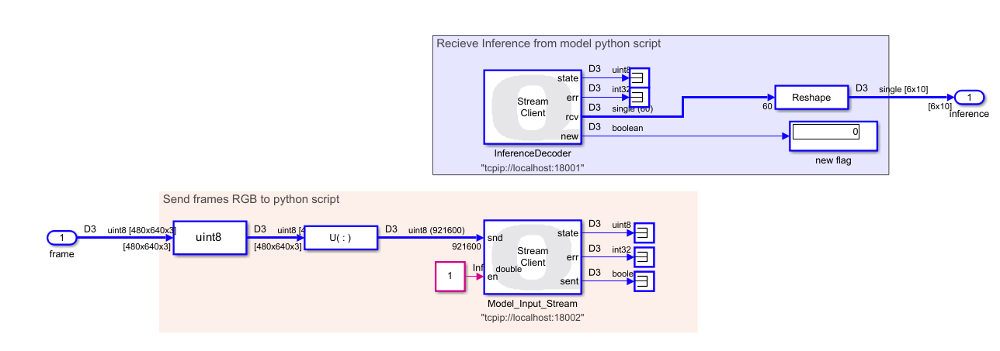
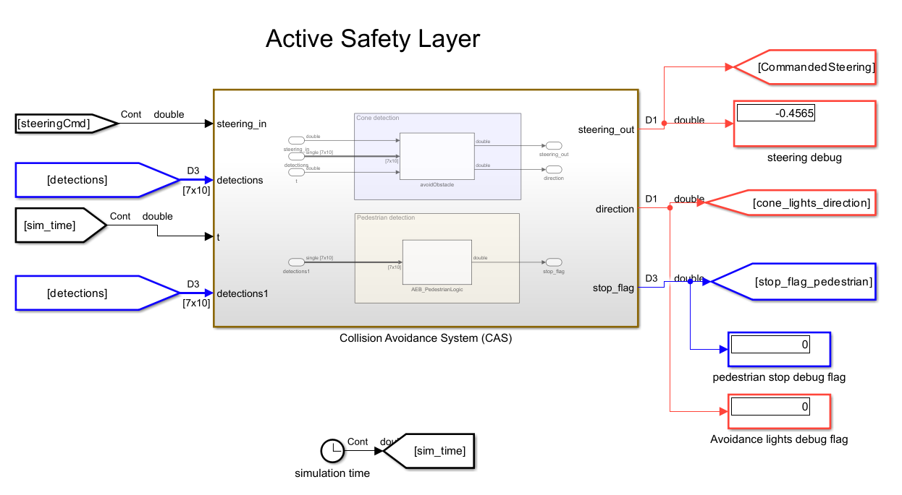

# Simulink Architecture

## General System Architecture in Simulink

The architecture implemented in Simulink was organized into clearly differentiated functional modules, so that each block was responsible for a specific task within the autonomous driving pipeline of the virtual QCar 2. This modular organization makes it possible to separate sensor acquisition, state estimation, trajectory planning, longitudinal and lateral control, visual perception with external inference in Python, traffic logic, and the final writing of commands to the vehicle. From an engineering perspective, this structure is important because it facilitates the individual validation of each subsystem and allows new functions to be integrated without completely altering the global behavior of the model.

In general terms, the system flow can be interpreted as a processing chain in which data from the vehicle and the environment are first acquired, then the current pose is estimated, afterward a trajectory reference is selected and the speed and steering commands are calculated, then visual events in the environment are analyzed through the neural network, and finally traffic decisions and light signals are applied before sending the actuation commands to the QCar.

---

## 1. Sensor reading block

**Figure.** `Read Sensors` subsystem where the internal QCar signals, such as speed, acceleration, and gyroscope data, are read.

The `readQCarDAC` block concentrates the acquisition of internal vehicle variables. Among its most important outputs are the measured speed (`measuredSpeed`), the accelerometer (`accel`), and the gyroscope (`gyro`), which are essential for control and state estimation. In addition, this block also provides other monitoring signals, such as odometer, battery voltage, motor current, battery level, motor power, and the `gyro_z` component. Although not all of these variables are used directly in the main navigation logic, they are part of the system instrumentation and make it possible to monitor the general behavior of the vehicle within the simulation.

From an architectural standpoint, this block represents the interface between the simulated plant and the rest of the controller. In other words, this is where the basic dynamic information of the QCar is obtained, which will later be used by the state estimation block and by longitudinal control.

---

**Figure.** Complementary sensor reading subsystem, where data from the LiDAR and the RealSense camera are captured.

In this part of the subsystem, two fundamental blocks appear: `lidarCapture` and `realsenseCapture`. The `lidarCapture` block provides the distances measured by the LiDAR, the angles associated with each measurement, and a flag called `newLidarReading`, which indicates when a new reading is available. This flag is important because it allows the estimated pose to be updated only when new sensor information arrives.

For its part, the `realsenseCapture` block provides two critical outputs for the perception module: the depth image (`realsenseDepthImage`) and the RGB image (`realsenseRGBImage`), together with the flags `newDepthImage` and `newRGBImage`. These signals are essential because the RGB image is used for object detection through the neural network, while the depth image is later used to compute the distance associated with each detection.

---

## 2. State estimation block

**Figure.** `stateEstimation` block, responsible for computing the current pose of the QCar from sensors and vehicle commands.

The `stateEstimation` block receives as inputs the pose coming from the LiDAR (`lidarPose`), the gyroscope, the `newLidarReading` flag, the vehicle speed, and the steering command. With these signals, the block estimates the current pose of the car, expressed as position in \(x\), position in \(y\), and orientation \(\theta\). This output appears labeled as `currentPose [x,y,heading] (m,m,rad)`.

The importance of this block is very high within the system, since the estimated pose is the variable that allows the algorithm to know where the vehicle is located inside the map. Based on this pose, the trajectory planner, the lateral controller, and also the lighting logic operate. In other words, this block acts as the bridge between the sensory measurements and the geometric representation of the vehicle within the environment.

---

## 3. Planning and lateral control blocks

**Figure.** Lateral processing subsystem composed of the `pathPlanner` and `steeringCommander` blocks.

The `pathPlanner` block, which appears in orange, receives the current vehicle pose and the desired or adjusted speed, as well as a look-ahead distance called `lookAheadDistance`. From these inputs, it produces as outputs the desired trajectory (`desiredPath`), the current point on the route (`currentPathXY`), the target point or next reference (`desiredPathXY`), and the distance between the vehicle and the trajectory (`distanceToPath`). This block functions as the local navigation layer over the global trajectory, since it decides which part of the path the car should follow at the current instant.

Above it is the `steeringCommander` block, responsible for lateral control. This block uses as inputs the yaw rate (`yawRate`), the identifier of the desired trajectory, the adjusted speed, the current pose, the distance to the path, and the current and desired coordinates on the route. From that information, it computes the final steering command (`steeringCmd`). Functionally, this block transforms the geometric information of the lateral error and the vehicle state into a steering signal that allows the trajectory to be followed in a stable way.

From a control perspective, both blocks work together: `pathPlanner` decides **which point of the route must be followed**, while `steeringCommander` decides **how to orient the vehicle in order to reach it**.

---

## 4. Longitudinal control block

**Figure.** `speedController` block, responsible for controlling the speed of the QCar.

The `speedController` block receives the target speed, the steering command, the currently measured speed, the distance to an obstacle, and a QCar enable flag. From these inputs it generates two main outputs: the PWM command to be applied to the motor (`pwmCmd`) and an adjusted speed called `tunedSpeedCmd`.

The logic of this block consists of transforming a desired speed into a longitudinal command that can be physically applied to the vehicle. However, its role is not limited to being a simple speed-to-PWM converter. It also incorporates the context of the environment through the distance to the obstacle and produces an adjusted speed that will later be used by the planner and by the traffic logic. This means that this block not only controls speed, but also adapts it to the current situation of the vehicle within the scenario.

---

## 5. Visual inference and Communication with Python

**Figure.** The Communication with Python subsystem handles the interaction between Simulink and a Python script that processes camera frames and performs inference using an image model. Its architecture enables efficient data transmission and reception of inference results for further processing within the Simulink model.

Send All Stream Client Quanser Block

The send block is configured in Send All mode, communicating with localhost on port 18002. This block transmits RGB camera frames to Python. Before sending, the data is processed as follows:

Conversion to uint8: Each camera frame is normalized to 8-bit integers, ensuring consistent transmission.
Reshape: The original frame array is reorganized into a column vector $X_{\text{col}} \in \mathbb{R}^{N \times 1}$, where $N$ is the total number of pixels per frame. This operation packages the data into a single linear vector suitable for transmission through the block.

Receive All Stream Client Quanser Block

The receive block is configured in Receive All mode on port 18001. Its purpose is to receive inference results generated in Python. Incoming data arrives as a linear vector and must be reconstructed for use in Simulink:

Reshape: The received vector is reorganized into a $6 \times 10$ matrix, $Y \in \mathbb{R}^{6 \times 10}$, representing the structured output of the inference model.
The resulting data can be used by other subsystems for decision-making and autonomous vehicle control.

**Figure.** Quanser blocks used to communicate Simulink with a Python script via TCP/IP.

---

## 6. Add distance for object detection
Once the inference is unpacked, the $6 \times 10$ matrix is passed to the previously described addDepth function to produce a $7 \times 10$ matrix, adding a new row corresponding to the distance of the detected object. This stage requires the depth frame from the RGB-D camera.

**Figure.** Function to get distances using roi.

---
## 7. Active Safety Layer
For this stage, the inputs are the SteeringCmd from the trajectory controller, the detection matrix, and a clock providing the simulation time. The outputs include stop flags, flags indicating activation of the left turn signal in case of obstacle avoidance, and the modified steering command applied to the vehicle.

**Figure.** ubsystem integrating obstacle avoidance and emergency stop functions

## 10. QCar writing block and final actuation

**Figure.** `writeToQCarDAC` block, responsible for applying the motor, steering, and lighting commands to the vehicle.

The `writeToQCarDAC` block is the final link in the control chain. It receives as inputs the motor command (`motor_cmd`), the steering command (`steering_cmd`), the LED vector (`leds`), and the RGB strip (`ledStrip`). This means that both the purely dynamic decisions of the vehicle and the light logic associated with braking and turn signals converge here.

According to your transcription, the RGB strip and the light signals are generated by a `light controller` block, to which you pass the current vehicle pose, the PWM, a pulse generator to make the turn signals blink, the smoothed trajectory, the segments where the left and right lights should be turned on, the `avoid` cone-avoidance flag, and the `stop_light` coming from the traffic logic. The central idea of that block is that the lights are activated either by **events** —such as a STOP, picking up a person, or avoiding a cone— or by **specific trajectory segments**, that is, zones where the car already knows it must indicate a maneuver to the left or to the right. You also explain that the pulse generator is multiplied by the left or right signal flags to create the real blinking effect, and that when the car is braking or the PWM is zero, the braking logic is activated on the light strip. :contentReference[oaicite:13]{index=13}

From a functional standpoint, this block represents the final interface between the controller and the plant. This is where all the decisions made throughout the pipeline become real actions on the QCar: moving forward, turning, braking, or turning on the corresponding light signals.

---

## Global interpretation of the architecture

Taken together, the architecture built in Simulink can be interpreted as a hierarchical system in which each block fulfills a well-defined function. The sensors deliver information about the vehicle and the environment; the state estimation computes the current pose; the planner and the lateral controller determine how to follow the trajectory; the speed controller adjusts the longitudinal motion; the perception module detects objects through the neural network and adds depth to them; the traffic logic decides whether the vehicle must stop, reduce speed, or continue; the avoidance function modifies steering if a cone appears; the light controller visually expresses the vehicle’s maneuvers and events; and finally, the writing block applies all of this to the QCar. This modular organization makes it possible for the system not to be a simple trajectory follower, but rather a complete self-driving architecture capable of perceiving, deciding, and acting in an integrated way.
