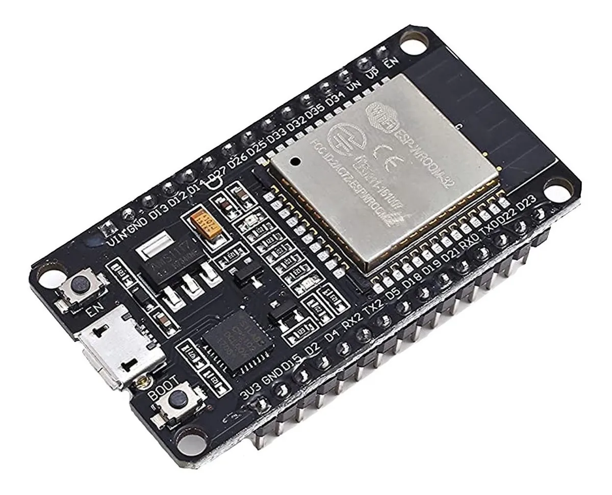
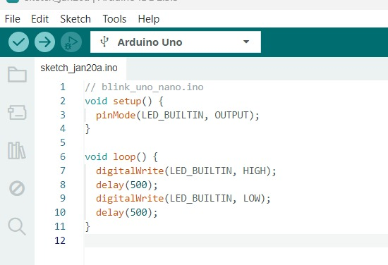
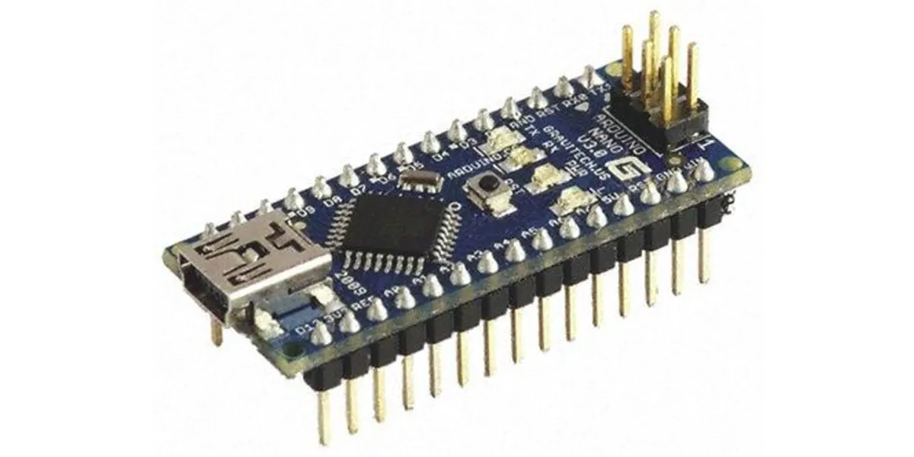
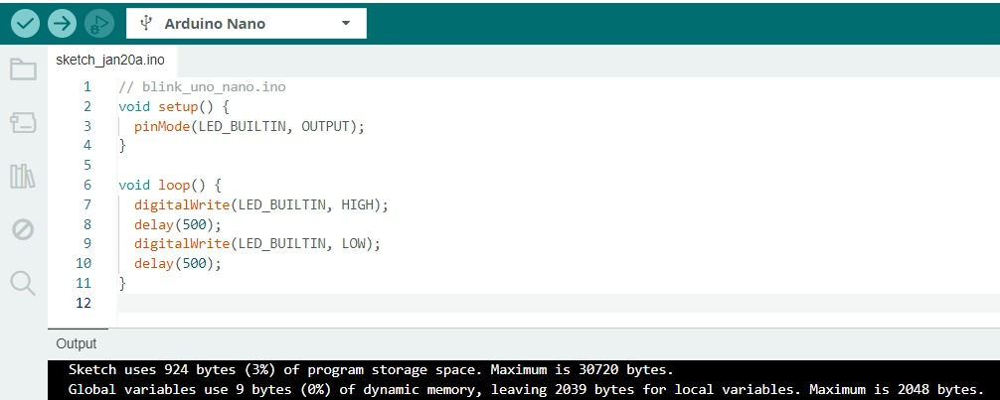
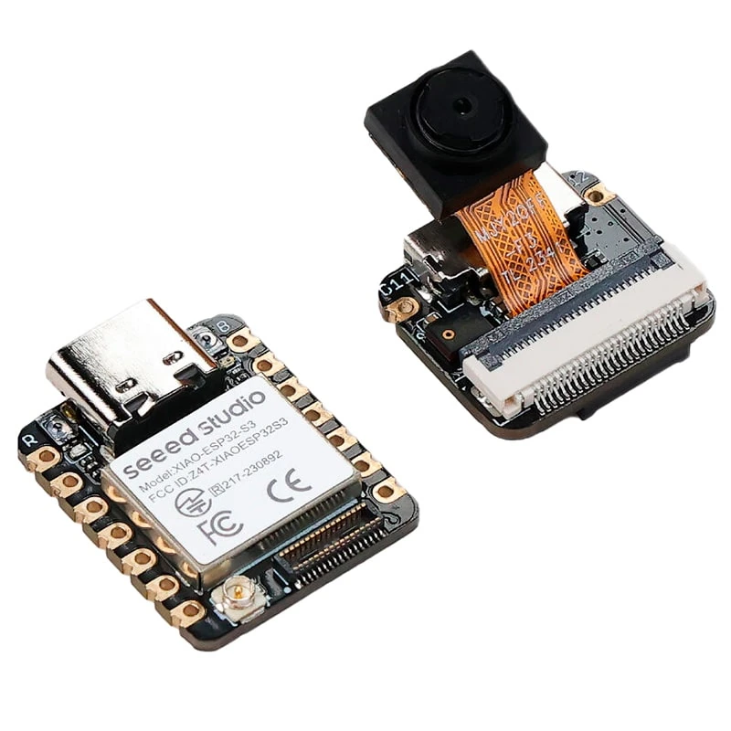
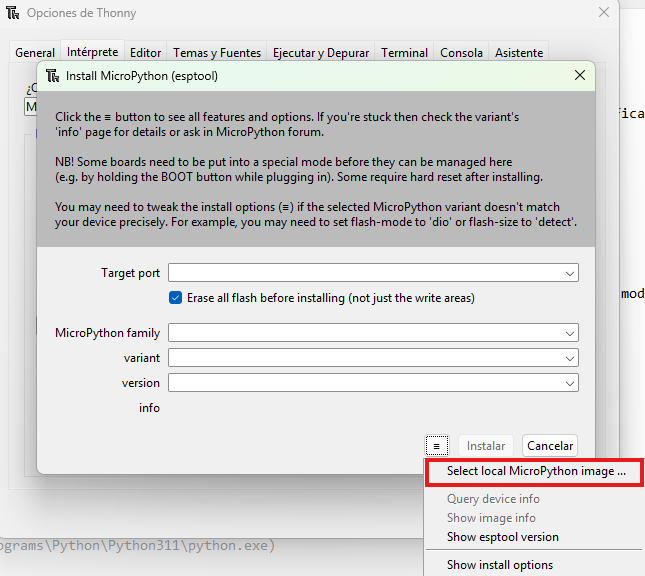

# Práctica 1: Sistemas Embebidos

En esta parte, programamos diferentes microcontroladores con el objetivo de aprender a utilizarlos, conocer sus distintas interfaces de programación y desarrollar un programa sencillo para hacer parpadear el *LED integrado* de cada uno:

## 1) ESP32 DevKit V1

### 1.1 Imagen del micro utilizado
En este apartado se muestra una fotografía del *ESP32 DevKit V1* que se utilizó, para identificar claramente el modelo y sus componentes principales (pines, puerto, etc.).


*Figura 1:* ESP32 DevKit V1.

### 1.2 Imagen de la configuración del intérprete
Aquí se incluye una captura de pantalla de la configuración del entorno/intérprete utilizado (en este caso, **Thonny**), mostrando parámetros clave como el modelo de la placa, el puerto COM y la versión del intérprete.


*Figura 2:* Thonny Micropyhton.

### 1.3 Video
<video controls width="720">
  <source src="{{ '/assets/videos/vESP32.mp4' | relative_url }}" type="video/mp4">
  Tu navegador no soporta video HTML5.
</video>

### 1.4 Programa
A continuación se muestra el *código utilizado* para hacer parpadear el LED integrado. Este programa permite verificar que la placa fue detectada correctamente y que la carga/ejecución funciona como se espera.


````md
```Mirco python
# blink_esp32_devkitv1.py
from machine import Pin
import time

LED = Pin(2, Pin.OUT)

while True:
    LED.value(1)
    time.sleep(0.5)
    LED.value(0)
    time.sleep(0.5)
```
````

## 2) Arduino UNO

### 2.1 Imagen del micro utilizado
En este apartado se muestra una fotografía del *Arduino UNO* que se utilizó, para identificar claramente el modelo y sus componentes principales (pines, puerto, etc.).


*Figura 3:* Arduino UNO.

### 2.2 Imagen de la configuración del intérprete
Aquí se incluye una captura de pantalla de la configuración del intérprete utilizado (en este caso, **La IDE de arduino**), mostrando parámetros clave como el modelo de la placa y el puerto COM.


*Figura 4:* Arduino IDE.

### 2.3 Video
<video controls width="720">
  <source src="{{ '/assets/videos/vArduinoUNO.mp4' | relative_url }}" type="video/mp4">
  Tu navegador no soporta video HTML5.
</video>

### 2.4 Programa
A continuación se muestra el *código utilizado* para hacer parpadear el LED integrado en el arduino. Este programa permite verificar que la placa fue detectada correctamente y que la carga funciona como se espera.

````md
```Arduino
// blink_uno_nano.ino
void setup() {
  pinMode(LED_BUILTIN, OUTPUT);
}

void loop() {
  digitalWrite(LED_BUILTIN, HIGH);
  delay(500);
  digitalWrite(LED_BUILTIN, LOW);
  delay(500);
}
```
````

## 3) Arduino Nano

### 3.1 Imagen del microcontrolador utilizado

En esta sección se presenta una fotografía del **Arduino Nano** empleado durante la práctica, con el objetivo de identificar claramente la tarjeta utilizada y sus principales componentes físicos.



*Figura 3: Tarjeta Arduino Nano utilizada en la programación.*

---

### 3.2 Imagen de la configuración en la IDE de Arduino

A continuación se muestra una captura de pantalla de la **IDE de Arduino**, donde se observa la selección del modelo de placa correspondiente al **Arduino Nano** y el puerto de comunicación.



*Figura 4: Configuración de placa y puerto para Arduino Nano.*

---

### 3.3 Video de funcionamiento

En el siguiente enlace se puede visualizar el video del funcionamiento del Arduino Nano, donde se observa el parpadeo del LED integrado:

<video controls width="720">
  <source src="{{ '/assets/videos/ArduinoNano.mp4' | relative_url }}" type="video/mp4">
  Tu navegador no soporta video HTML5.
</video>


### 3.4 Programa utilizado

```arduino
// blink_nano.ino
void setup() {
  pinMode(LED_BUILTIN, OUTPUT);
}

void loop() {
  digitalWrite(LED_BUILTIN, HIGH);
  delay(500);
  digitalWrite(LED_BUILTIN, LOW);
  delay(500);
}
```
## 4) XIAO ESP32-S3

### 4.1 Imagen del micro utilizado

En este apartado se muestra una fotografía del *XIAO ESP32-S3* que se utilizó, para identificar claramente el modelo y sus componentes principales (pines, puerto, etc.).


*Figura 5:* XIAO ESP32-S3.

---

### 4.2 Imagen de la configuración del intérprete

Aquí se incluye una captura de pantalla de la configuración del entorno/intérprete utilizado (en este caso, **Thonny**), mostrando parámetros clave como el tipo de placa, el puerto COM y el intérprete seleccionado.


*Figura 6:* Thonny MicroPython (XIAO ESP32-S3).

---

### 4.3 Instalación de firmware (MicroPython)

Para esta placa fue necesario instalar el firmware, ya que se programó en **MicroPython**. Primero se consultó la guía oficial de Seeed Studio, donde se indican los pasos y el firmware recomendado para la XIAO ESP32-S3:
[Guía de Seeed Studio (XIAO ESP32S3 con MicroPython)](https://wiki.seeedstudio.com/xiao_esp32s3_with_micropython/)

Dentro de esa página se indica el nombre del archivo a instalar, en este caso **ESP32_GENERIC_S3-20230602-v1.23.0.bin**. Después se dio clic en el enlace **“file from micropython.org”**, lo cual redirige a la página de descargas de MicroPython. Ya en esa página se buscó el archivo indicado y se descargó la versión **v1.23.0 (.bin)**.


*Figura 7:* Página de firmware donde se identifica la versión a descargar.

Posteriormente se abrió **Thonny** y se configuró el intérprete seleccionando MicroPython para ESP32. Después se ingresó a la opción **“Instalar o actualizar MicroPython (esptool)”**, se verificó que se detectara correctamente el puerto donde estaba conectada la XIAO ESP32-S3, y se seleccionó la familia **ESP32-S3**. En la opción de *variant* no aparece directamente el modelo de la placa, por lo que se cargó el firmware descargado de forma local. Para esto se presionó el ícono de menú (tres líneas), se eligió **“Select local MicroPython image …”** y se seleccionó el archivo **.bin** previamente descargado. Una vez finalizada la instalación, la placa quedó lista para programarse desde Thonny sin problemas.


*Figura 8:* Selección de firmware local en Thonny.


*Figura 9:* Proceso de escritura/instalación del firmware en Thonny.

---

### 4.4 Video

En el siguiente enlace se puede visualizar el video del funcionamiento del XIAO ESP32-S3, donde se observa el parpadeo del LED integrado:

<video controls width="720">
  <source src="{{ '/assets/videos/XIAO ESP32-S3.mp4' | relative_url }}" type="video/mp4">
  Tu navegador no soporta video HTML5.
</video>

### 2.5 Programa

A continuación se muestra el *código utilizado* para hacer parpadear el LED. Este programa permite verificar que la placa fue detectada correctamente y que la carga/ejecución funciona como se espera.

```python
# blink_xiao_esp32s3.py
from machine import Pin
import time

LED = Pin(21, Pin.OUT)  # activo-bajo

while True:
    LED.value(0)  # ON
    time.sleep(0.5)
    LED.value(1)  # OFF
    time.sleep(0.5)
```
## 5) XIAO RP2040

### 5.1 Imagen del micro utilizado

En este apartado se muestra una fotografía del *XIAO RP2040* que se utilizó, para identificar claramente el modelo y sus componentes principales (pines, puerto, etc.).


*Figura 10:* XIAO RP2040.

---

### 5.2 Imagen de la configuración del intérprete

Aquí se incluye una captura de pantalla de la configuración del entorno/intérprete utilizado (en este caso, **Thonny**), mostrando parámetros clave como el tipo de placa, el puerto y la versión del intérprete.


*Figura 11:* Thonny MicroPython (XIAO RP2040).

---

### 5.3 Video

En el siguiente enlace se puede visualizar el video del funcionamiento del XIAO RP20240, donde se observa el parpadeo del LED integrado:

<video controls width="720">
  <source src="{{ 'assets/videos/blinkRP2040.mp4' | relative_url }}" type="video/mp4">
  Tu navegador no soporta video HTML5.
</video>

### 5.4 Programa

A continuación se muestra el *código utilizado* para hacer parpadear el LED integrado. Este programa permite verificar que la placa fue detectada correctamente y que la carga/ejecución funciona como se espera.

```python
# blink_xiao_rp2040.py
from machine import Pin
import time

LED = Pin(17, Pin.OUT)  # activo-bajo

while True:
    LED.value(0)  # ON
    time.sleep(0.5)
    LED.value(1)  # OFF
    time.sleep(0.5)
```

---

### 5.5 Nota adicional

Antes de conectar la XIAO RP2040 para que el equipo la detecte correctamente, es necesario presionar el botón **BOOT** y mantenerlo presionado mientras se conecta el cable USB a la computadora. Esto permite que la placa entre en modo de carga y aparezca como unidad/dispositivo, facilitando su reconocimiento en Thonny.