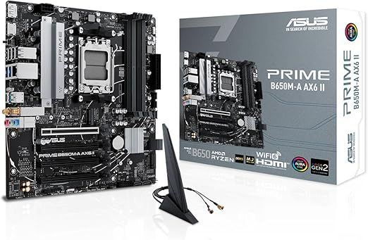
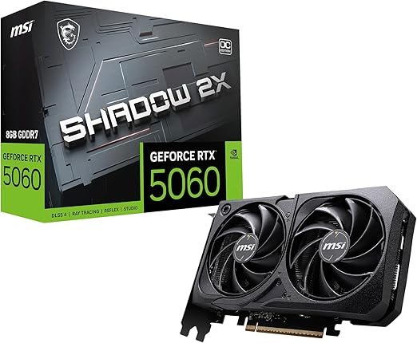
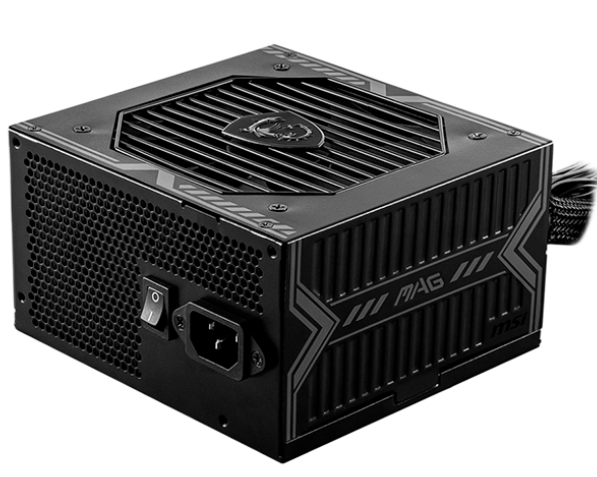
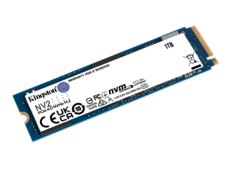
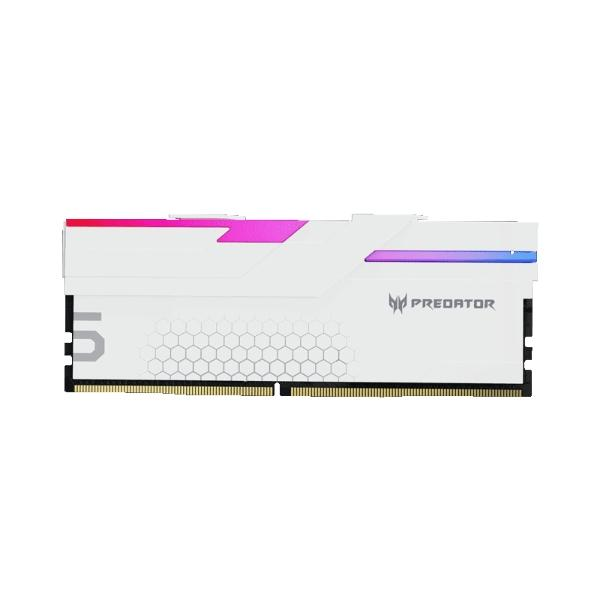
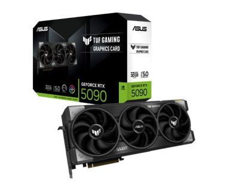
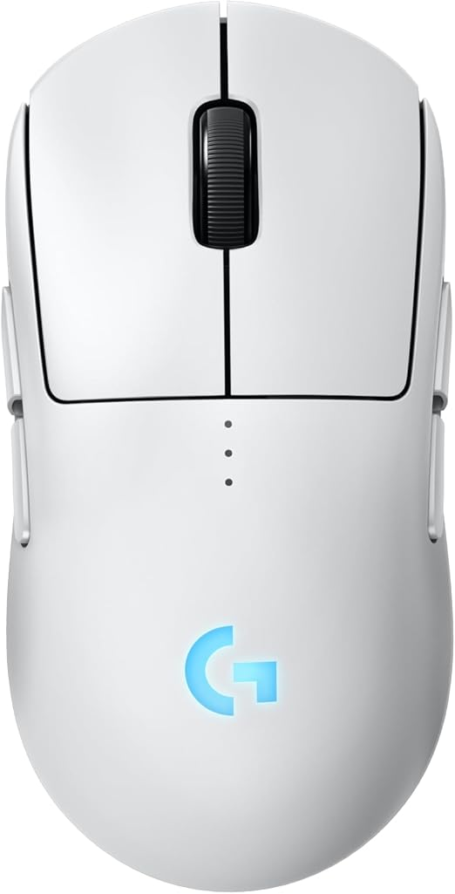
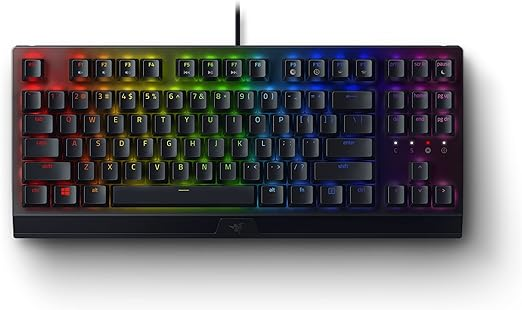
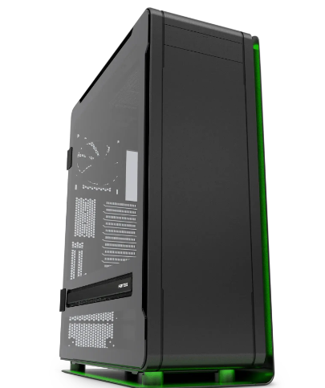
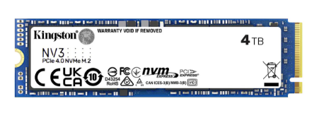

# Ejercicio: selección de equipo de cómputo con presupuesto definido

## 1) Componentes

1. Procesador (CPU)
2. Placa Base (Motherboard)
3. Memoria RAM
4. Tarjeta Gráfica (GPU)
5. Fuente de Poder
6. Teclado
7. Mouse
8. Almacenamiento (SSD o HDD)
9. Ventiladores de Gabinete
10. Gabinete (Torre)
11. Monitor

## 2) Propuesta límite $25,000

Se ocupo un total de $24,483

### 2.1) Procesador AMD RYZEN 7 7700
- 5.3 GHz  
- 8 núcleos  
- Socket AM5  

Precio: $5,899

Link: <https://ddtech.mx/producto/procesador-amd-ryzen-7-7700-5-3-ghz-8-nucleos-socket-am5-amd-radeon-graphics-100-100000592box-7000-series?id=12368>

*Figura 1:* Procesador AMD RYZEN 7 7700.

### 2.2) Tarjeta madre ASUS Prime B650M-A AX6
- Capcidad 192 GB
- RAM DDR5 
- Modelo de CPU Ryzen 7
- Socket AM5

Precio: $2,391

Link: <https://www.amazon.com.mx/ASUS-Tarjeta-B650M-AX6-II/dp/B0FH5RFTYW/ref=asc_df_B0FH5RFTYW?mcid=b49a30fd395739d08a9e046c62254f38&tag=gledskshopmx-20&linkCode=df0&hvadid=761967928071&hvpos=&hvnetw=g&hvrand=7741242411400839862&hvpone=&hvptwo=&hvqmt=&hvdev=c&hvdvcmdl=&hvlocint=&hvlocphy=9196927&hvtargid=pla-2441705692528&psc=1&language=es_MX&gad_source=1>

*Figura 2:* Tarjeta madre ASUS Prime B650M-A AX6.

### 2.3) Memoria RAM XTREME PC GAMING KINGSTON
- Capcidad 16GB
- Frecuencia 5600MHz
- Generación DDR5
- RGB

Precio: $1,599

Link: <https://www.xtremepc.com.mx/products/memoria-ram-xtreme-pc-gaming-kingston-fury-beast-rgb-ddr5-16gb-5600mt-s-1x16gb-negro>

*Figura 3:* Memoria RAM XTREME PC GAMING KINGSTON.

### 2.4) Tarjeta gráfica MSI Gaming RTX 5060
- NVIDIA GeForce RTX 5060
- RAM 8GB para gráfico 
- Frecuencia 2535 MHz

Precio: $6,635

Link: <https://www.amazon.com.mx/MSI-Tarjeta-gr%C3%A1fica-Rendimiento-Extremo/dp/B0F4LP8VH5/ref=asc_df_B0F4LP8VH5?mcid=70c017d3b5193cbdbc5a8acd28112c65&tag=gledskshopmx-20&linkCode=df0&hvadid=745054174681&hvpos=&hvnetw=g&hvrand=1722777082906757481&hvpone=&hvptwo=&hvqmt=&hvdev=c&hvdvcmdl=&hvlocint=&hvlocphy=9196927&hvtargid=pla-2616278449112&psc=1&language=es_MX&gad_source=1>

*Figura 4:* Tarjeta gráfica MSI Gaming RTX 5060.

### 2.5) Mouse Inalámbrico Ergonómico
- 6 DPIs
- Frecuencia 2.4 GHz

Precio: $229

Link: <https://www.amazon.com.mx/Inal%C3%A1mbrico-Ergon%C3%B3mico-Recargable-Ajustables-Ergonomico/dp/B0CSN8P8G2/ref=asc_df_B0CSN8P8G2?mcid=e4305f20055632e98b78b4a1716084d9&tag=gledskshopmx-20&linkCode=df0&hvadid=709966298345&hvpos=&hvnetw=g&hvrand=10906713632831497011&hvpone=&hvptwo=&hvqmt=&hvdev=c&hvdvcmdl=&hvlocint=&hvlocphy=9131460&hvtargid=pla-2297582641595&language=es_MX&gad_source=1&th=1>

*Figura 5:* Mouse Inalámbrico Ergonómico.

### 2.6) Teclado Logitech K120 
- USB

Precio: $208

Link: <https://intercompras.com/p/teclado-logitech-k120-usb-negro-63377?srsltid=AfmBOopDQu_jOzifyBayn2VPSs-Qr4LGMM6QxlDLFagjRO0iiOQbAcEbCPo>

*Figura 6:* Teclado Logitech K120.

### 2.7) Fuente de poder MSI MAG A650BN
- Potencia total 650 W
- Eficiencia 80 plus 
- Ventilador 120mm

Precio: $999

Link: <https://coregaming.com.mx/producto/fuente-de-poder-msi-mag-a650bn-80-plus-bronze-24-pin-atx-120mm-no-modular-650w-mag-a650bn>

*Figura 7:* Fuente de poder MSI MAG A650BN.

### 2.8) Gabinete DeepCool CC360 ARGB
- Potencia total 650 W
- Eficiencia 80 plus 
- Ventilador 120mm

Precio: $999

Link: <https://www.cyberpuerta.mx/Computo-Hardware/Componentes/Gabinetes/Gabinete-DeepCool-CC360-ARGB-Micro-Tower-Micro-ATX-Mini-ITX-USB-2-0-3-0-sin-Fuente-3-Ventiladores-Instalados-Negro.html>

*Figura 8:* Gabinete DeepCool CC360 ARGB.

### 2.9) Almacenamiento Unidad SSD KINGSTONG NV2
- Capacidad 1 TB
- Interfaces de conexión: PCIe Gen 4.0 x4 y NVMe.

Precio: $2,650

Link: <https://www.mercadolibre.com.mx/unidad-ssd-kingston-nv2-1tb-m2-nvme-40-3500mb-2100mbs-color-turquesa/p/MLM19738268?pdp_filters=item_id%3AMLM2716408459&from=gshop&matt_tool=22537694&matt_word=&matt_source=google&matt_campaign_id=22122739109&matt_ad_group_id=172792511425&matt_match_type=&matt_network=g&matt_device=c&matt_creative=729726340073&matt_keyword=&matt_ad_position=&matt_ad_type=pla&matt_merchant_id=735123306&matt_product_id=MLM19738268-product&matt_product_partition_id=2389849485285&matt_target_id=aud-2418605323168:pla-2389849485285&cq_src=google_ads&cq_cmp=22122739109&cq_net=g&cq_plt=gp&cq_med=pla&gad_source=1&gad_campaignid=22122739109&gbraid=0AAAAAoTLPrI4Qv1aItsKIqSVYr1WRig3m&gclid=CjwKCAiA1obMBhAbEiwAsUBbIrTh33K7MhgUVZmeV57MA6nZn0Yv4Nbo8RrNrlFsbBGf79Cq88359RoCC9YQAvD_BwE>

*Figura 9:* Almacenamiento Unidad SSD KINGSTONG NV2.

### 2.10) Monitor Gamer Curvo MSI G243CV
- Pantalla 23.6"
- Resolución 1920x1080 Full HD
- 75Hz

Precio: $3,249

Link: <https://www.cyberpuerta.mx/Computo-Hardware/Monitores/Monitores/Monitor-Gamer-Curvo-MSI-G243CV-LCD-23-6-1920x1080-Full-HD-FreeSync-75Hz-HDMI-DisplayPort-Negro.html?gad_source=1&gad_campaignid=22512533880&gbraid=0AAAAAD4nXn3tcNz6vuV0DwbuL5JBr_G90&gclid=CjwKCAiA95fLBhBPEiwATXUsxBctVbyCNPg-smRvtyZ23YGS8-K2b_Eu1tcXMTBJzVDULR4qUxetXhoCfmcQAvD_BwE>

*Figura 10:* Monitor Gamer Curvo MSI G243CV.

## 3) Propuesta sin límite 

### 3.1) Procesador AMD Ryzen 9 9950X3D
- Modelo de CPU Ryzen 9
- Velocidad de CPU 4,3 GHz
- Enchufe de CPU Socket AM5

Precio: $14,574

Link: <https://www.amazon.com.mx/AMD-Ryzen-9950X3D-Procesador-100-100000719WOF/dp/B0DVZSG8D5/ref=asc_df_B0DVZSG8D5?mcid=22c845a40e18394fbc72cfb43127ca24&tag=gledskshopmx-20&linkCode=df0&hvadid=730033385251&hvpos=&hvnetw=g&hvrand=17874551098524341697&hvpone=&hvptwo=&hvqmt=&hvdev=c&hvdvcmdl=&hvlocint=&hvlocphy=9196927&hvtargid=pla-2408213641585&psc=1&language=es_MX&gad_source=1>

*Figura 11:* Procesador AMD Ryzen 9 9950X3D.

### 3.2) Tarjeta Madre ASUS ROG Crosshair X870E 
- Modelo de CPU Ryzen 7
- Velocidad de 4000 MHz
- Enchufe de CPU Socket AM5
- Tecnología DDR5

Precio: $15,227

Link: <https://www.amazon.com.mx/ASUS-ROG-Crosshair-X870E-Ventilador/dp/B0F25LTGBN/ref=asc_df_B0F25LTGBN?mcid=3e241b9369a83d96aaa012c153e5ec21&tag=gledskshopmx-20&linkCode=df0&hvadid=782828334665&hvpos=&hvnetw=g&hvrand=4005715194923192889&hvpone=&hvptwo=&hvqmt=&hvdev=c&hvdvcmdl=&hvlocint=&hvlocphy=9196927&hvtargid=pla-2431810329829&language=es_MX&gad_source=1&th=1>

*Figura 12:* Tarjeta Madre ASUS ROG Crosshair X870E.

### 3.3) RAM predator memoria ddr5 predator hermes
- Velocidad de 6400 MHz
- Memoria interna DDR5 64GB

Precio: $5,697

Link: <https://www.sears.com.mx/producto/3796806/predator-memoria-ddr5-predator-hermes-64gb-2x32-6400mhz-cl32-bco-bl-9bwwr-423?gad_source=1&gad_campaignid=23090003227&gbraid=0AAAAADLldArxXcV5mWiCwJGDad7vOE8PV&gclid=CjwKCAiA95fLBhBPEiwATXUsxBan-yBFntd3Uqv4Ro-HIxgqHuZ8aACoX3PllX3fuxNT1iBB5HVz7hoCNVIQAvD_BwE>

*Figura 13:* RAM predator memoria ddr5 predator hermes.

### 3.4) Tarjeta Gráfica NVIDIA GeForce RTX 5090 de 32GB GDDR7 
- GDDR7
- 32 GB
- 7680 x 4320 Pixeles 512 Bit 28 Gbit/s PCI Express 5.0
- Número de puertos HDMI: 2 Cantidad de DisplayPorts: 3

Precio: $28,369

Link: <https://intercompras.com/p/tarjeta-video-asus-tuf-gaming-geforce-rtx-32gb-bit-pci-e-gddr7-hdmi-415717?gad_source=1&gad_campaignid=1711130332&gbraid=0AAAAAD_EkoHvCZWztbbQuL5JBl8Ngd5Jl&gclid=CjwKCAiA1obMBhAbEiwAsUBbIgD96ozbD4gGsMLh4pENPa3RWRw5QJQ4OtD80c0klR1dngPXFeno5RoCQkgQAvD_BwE>

*Figura 14:* Tarjeta Gráfica NVIDIA GeForce RTX 5090 de 32GB GDDR7 .

### 3.5) Mouse Logitech G Pro 2 Lightspeed Mouse inalámbrico 
- 4 Botones Laterales magnéticos 
- Sensor de 44,000 dpi
- Carga USB-C
- PC/Mac - Blanco

Precio: $2,499

Link: <https://www.amazon.com.mx/Logitech-Lightspeed-inal%C3%A1mbrico-magn%C3%A9ticos-Personalizables/dp/B0DJFZ7S4R/ref=asc_df_B0DJFZ7S4R?mcid=18771c3aefad32feb0a17b05583f6a25&tag=gledskshopmx-20&linkCode=df0&hvadid=730033385251&hvpos=&hvnetw=g&hvrand=2178580473951129706&hvpone=&hvptwo=&hvqmt=&hvdev=c&hvdvcmdl=&hvlocint=&hvlocphy=1010097&hvtargid=pla-2386188072670&language=es_MX&gad_source=1&th=1>

*Figura 15:* Mouse Logitech G Pro 2 Lightspeed Mouse inalámbrico.

### 3.6) Teclado Razer BlackWidow V3 Tenkeyless
- USB

Precio: $2,288

Link: <https://www.amazon.com.mx/Razer-RazerTM-BlackWidow-Tenkeyless-StandardWindows/dp/B09698GFZJ/ref=asc_df_B09698GFZJ?mcid=d3c1c50ba407359f9c3719e0d8a85c86&gad_source=1&gad_campaignid=22597582687&gbraid=0AAAAAqmHpTEsQB8kqHA4yoUf-XUO2l4JW&gclid=CjwKCAiA95fLBhBPEiwATXUsxJ34umo5a75oKjfQe21XhWLWyjMkf88OGI00Bho7UOR7bvid3YT9jhoCtDgQAvD_BwE&th=1>

*Figura 16:* Teclado Razer BlackWidow V3 Tenkeyless.

### 3.7) Fuente de poder Corsair Rm1000e 80 Plus Titanium Modular Atx Negro
- Fuente de tipo ATX

Precio: $3,739

Link: <https://www.mercadolibre.com.mx/fuente-de-poder-corsair-rm1000e-80-plus-titanium-modular-atx-negro/p/MLM47389652#polycard_client=search-nordic&search_layout=grid&position=1&type=product&tracking_id=e50020b1-d311-429a-93ec-5b7873f6a4b1&wid=MLM2361246587&sid=search>

*Figura 17:* Fuente de poder Corsair Rm1000e 80 Plus Titanium Modular Atx Negro.

### 3.8) Gabinete ENTHOO ELITE
- Dimensiones 270 x 750 x 615 mm / 10.6 x 29.5 x 24.2 in

Precio: $4,601

Link: <https://phanteks.com/product/enthoo-elite/>

*Figura 18:* Gabinete ENTHOO ELITE.

### 3.9) Almacenamiento Unidad SSD Interno Kingston Nv3 
- Capacidad: 4 TB.
- Con tecnología 3D NAND.
- Útil para guardar programas y documentos con su capacidad de 4 TB

Precio: $5,799

Link: <https://www.mercadolibre.com.mx/unidad-ssd-interno-kingston-nv3-4tb-m2-nvme-40-6000mbs/p/MLM43202245#polycard_client=search-nordic&search_layout=grid&position=1&type=product&tracking_id=795ea1b7-d6eb-48e1-8703-3982b6342e43&wid=MLM4644877024&sid=search>

*Figura 19:* Almacenamiento Unidad SSD Interno Kingston Nv3 .

### 3.10) Monitor LG Monitor Curvo UltraWide Gaming 
- 34"
- 160Hz 
- Tiempo de Respuesta 1ms, 
- Puerto HDMI

Precio: $6,999

Link: <https://www.amazon.com.mx/LG-34GP63A-B-UltraWide-Monitor-FreeSync/dp/B0BRYVKW7F/ref=sr_1_2?adgrpid=143727048150&dib=eyJ2IjoiMSJ9.c9Ww2fKA9jiKHUepzw4AEZngWBMiHEHlnmIiTLiBGNvTE0FaFrSzFrrM5A68LvLkTx2M3mZ9WqzUJogkeDhgZV802JRqnX5TtagxMm3UJHTYqVzUi4TVeU6xlwyUiSpJ9tRZwya9O5Lk_0VkTyhNFIdixTd6JrDmbdHe8E9pnA0louHyatfJlcOcyvjlgipUHwBmmB0umtBzR3gEc9GVoF1z40b1GNaZbWoznxus6AtwLgnQ6UaMNqUY85JxgMUdTL-uAJrvvTRuQKrYu63ULIyuhynOh9P8BajvKjxUOus.N4TwQYwUzuQ_sds3amuLo0BFL6ouq8-Xid-phTrMLSk&dib_tag=se&hvadid=678136428460&hvdev=c&hvlocphy=1010097&hvnetw=g&hvqmt=b&hvrand=5357735989054795654&hvtargid=kwd-1050338096084&hydadcr=27006_14537407&keywords=lg%2B34gn850-b%2Bultrawide&mcid=77cf17554ff63961b35409b079399eae&qid=1768361744&sr=8-2&th=1>

*Figura 20:* Monitor LG Monitor Curvo UltraWide Gaming.